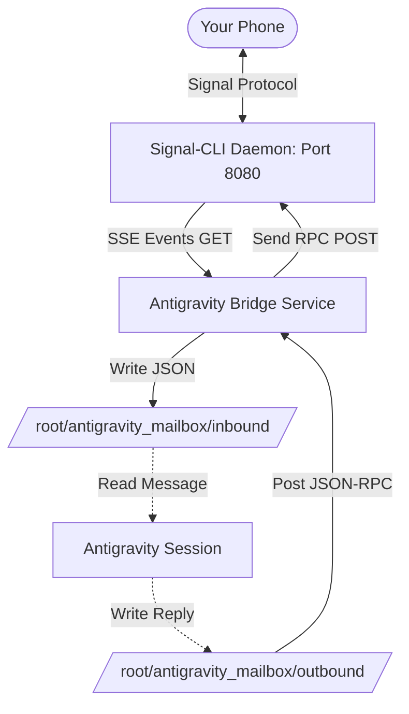

# 🛰️ Antigravity Signal Mailbox Bridge

This repository tracks the end-to-end setup, installation, and deployment of a **file-based Signal Messenger Integration** designed specifically for **Antigravity** (and other session-based coding/virtualization assistants) running on **Proxmox VE (PVE) / Debian**.

---

## 📖 Overview & Architecture

Conventional chat integrations require a persistent background agent running its own LLM completion loop. For session-based assistants (like Antigravity or custom terminal environments), running a persistent completion loop inside a CLI is either impossible or suffers from DB locking conflicts.

The **Mailbox Pattern** solves this beautifully. By using a lightweight background bridge service to manage communication states, inbound and outbound traffic is decoupled into simple, file-based directories:



### Key Highlights:
1. **Decoupled Messaging:** Avoids file-locking issues with `signal-cli` by leveraging a local HTTP/JSON-RPC daemon.
2. **Note-to-Self Support:** Natively supports "Note to Self" messages (sync sent messages), letting you text your own bot number directly to orchestrate tasks.
3. **Zero LLM Overhead on Idle:** Background operations consume near-zero resources (only checking files/polling SSE stream) until you invite the assistant to process the mailboxes.
4. **Local Network Visibility:** Configured to bind to `0.0.0.0:8080`, allowing external computers on your local network to query the status or interact with the Signal REST API.

---

## 🚀 Step 1. Prerequisites & Java 25 Runtime Setup

Recent releases of `signal-cli` are compiled against **Java 25 (class file version 69.0)**. Running standard Debian JRE environments yields a `java.lang.UnsupportedClassVersionError`.

To run bleeding-edge Java runtimes cleanly without breaking native Debian package mappings, we utilize **SDKMAN!**:

```bash
# 1. Install required support utilities
apt update && apt install curl zip unzip -y

# 2. Install SDKMAN!
curl -s "https://get.sdkman.io" | bash
source "$HOME/.sdkman/bin/sdkman-init.sh"

# 3. Install OpenJDK 25 and map as default
sdk install java 25-open
java -version
```

---

## 🔑 Step 2. Signal Account Linking

Ensure `signal-cli` is downloaded and linked as a secondary device to your primary Signal app (on your phone):

```bash
# Generate the device linking payload and QR Code
signal-cli link -n "AntigravityAgent"
```

* **Action:** Open Signal on your mobile client, head to `Settings ➔ Linked Devices ➔ Link New Device`, and scan the printed terminal QR code.

---

## ⚙️ Step 3. Deploying the Signal HTTP Daemon

We wrap `signal-cli` as a background HTTP daemon running on Port `8080`. To ensure it accepts external requests on your private LAN, we bind it to `0.0.0.0`.

1. **Deploy Systemd Service:** Copy [signal-daemon.service](./signal-daemon.service) to `/etc/systemd/system/signal-daemon.service`. Make sure to replace `+YOUR_PHONE_NUMBER` with your registered Signal account:

```bash
# Edit file and copy to systemd folder
cp signal-daemon.service /etc/systemd/system/
nano /etc/systemd/system/signal-daemon.service
```

2. **Initialize and Start Daemon:**
```bash
# Clean up any manually executed instances
pkill -f signal-cli

# Reload systemd and launch daemon
systemctl daemon-reload
systemctl start signal-daemon
systemctl enable signal-daemon

# Verify stable runtime status
systemctl status signal-daemon
```

---

## ⚙️ Step 4. Deploying the Antigravity Mailbox Bridge

The `signal_bridge.py` script acts as the bi-directional liaison. It runs persistently to stream inbound text messages (via SSE) into the `inbound` mailbox and poll the `outbound` directory for queued replies.

1. **Setup Directory Structures:**
```bash
mkdir -p /root/antigravity_mailbox/inbound
mkdir -p /root/antigravity_mailbox/outbound
```

2. **Deploy Bridge Script:** Move the `signal_bridge.py` script into your configuration folder and make it executable:
```bash
cp signal_bridge.py /root/antigravity_mailbox/
chmod +x /root/antigravity_mailbox/signal_bridge.py
```

3. **Install Bridge Service:** Copy [antigravity-bridge.service](./antigravity-bridge.service) into `/etc/systemd/system/`:
```bash
cp antigravity-bridge.service /etc/systemd/system/
systemctl daemon-reload
systemctl start antigravity-bridge
systemctl enable antigravity-bridge

# Confirm clean loopback connection
systemctl status antigravity-bridge
```

---

## 📬 Step 5. File Formats & Mailbox Schema

The directories `/root/antigravity_mailbox/inbound/` and `/root/antigravity_mailbox/outbound/` contain simple JSON payloads.

### 📥 Inbound Message JSON
When a text arrives, it is captured inside `inbound/` as `<timestamp>_<sender>.json`:
```json
{
  "sender": "+YOUR_PHONE_NUMBER",
  "text": "Check VM status!",
  "timestamp": 1780275349245,
  "sourceName": "Tim Sonner",
  "isSyncMessage": true
}
```

### 📤 Outbound Reply JSON
To transmit a message back to a user, generate a JSON file in `outbound/` (e.g., `reply_100.json`). The bridge service will instantly deliver it and delete the file:
```json
{
  "recipient": "+YOUR_PHONE_NUMBER",
  "text": "All VMs are healthy!"
}
```

---

## 🧠 Step 6. Interactive Session Workflows

During live pair-programming sessions, you can direct your assistant to seamlessly manage your Signal communications:

1. **Operator:** *"Antigravity, check my mailbox."*
   * **Assistant:** Lists and parses files inside `inbound/`, extracts the text, and displays it to you.
2. **Operator:** *"Can you reply to +YOUR_PHONE_NUMBER and say: Setup is complete!"*
   * **Assistant:** Instantly writes a JSON file inside `outbound/`, which the background service dispatches in under a second.
3. **Operator:** *"Check on Proxmox VMs, and text me the report on Signal."*
   * **Assistant:** Executes Proxmox system checks (`qm list`, `df -h`), compiles the report, and drops the outgoing JSON in the mailbox to deliver straight to your phone.

---

## ⚡ Step 7. Hands-Free Automated Agent Polling (Zero Clicks)

To allow the agent to poll for messages automatically while you are away (e.g., while at work) with **no keyboard clicks or manual approvals required**, we utilize the **Cascading Agent Polling Timer Pattern**.

This takes advantage of the platform's native scheduling tool (`schedule`) recursively:

### The Architecture:
1. **Initial Trigger:** The agent schedules a 60-second one-shot timer with a prompt that tracks the latest processed timestamp (e.g., `1780278019500`).
2. **Periodic Check:** Every 60 seconds, the timer fires, waking up the agent.
3. **Scan Inbound Mailbox:** The agent runs a quick, lightweight directory list on `/root/antigravity_mailbox/inbound/`.
   - **If new messages exist** (timestamp > threshold): The agent reads them, displays them, processes instructions (e.g., executing commands or compiling stats), and generates replies.
   - **If no new messages exist:** The agent does nothing.
4. **Cascading Continuation:** Whether messages were found or not, at the very end of the turn, the agent schedules the **next** 60-second timer. If new messages were processed, the agent updates the threshold timestamp in the scheduled prompt to the highest timestamp found, preventing reprocessing.

### Why this is highly optimized:
* **No Clicks/Approvals:** Native platform scheduler timers do not require manual user review or terminal execution prompts, allowing 100% autonomous operation.
* **Low Idle Cost:** Since no heavy background loops are executed, the agent only wakes up for a tiny fraction of a second every minute, verifying files with a fast `list_dir` scan and immediately going back to sleep if the mailbox is empty.

---

## 🔒 Streamer Mode (Phone Number Redaction)

To protect your personal mobile phone numbers during live-streams, video demonstrations, or sharing terminal screenshots, the Mailbox Bridge features a built-in **Streamer Mode**.

### What It Does:
1. **Log Redaction:** All incoming, outgoing, and file creation logs processed by `signal_bridge.py` have E.164 phone numbers stripped and replaced with `+[REDACTED]`.
2. **Terminal Redaction:** The terminal-facing `mailbox_watcher.py` automatically redacts file names and parsed message payloads when printing new traffic on-screen.
3. **HTTP Log Muting:** Mutes third-party HTTP logs (such as raw request endpoint paths from `httpx`) to prevent any query-parameter leaks of connection accounts.
4. **Intact Backend Routing:** The actual file storage, inbound payloads on disk, and outgoing API RPC calls continue to use real numbers under the hood, ensuring the application functions flawlessly.

### How to Enable:
To turn on Streamer Mode, add the configuration variable to your active `.env` file and restart the system service:

```bash
# 1. Enable Streamer Mode in active configuration
echo "STREAMER_MODE=true" >> /root/antigravity_mailbox/.env

# 2. Restart the mailbox bridge daemon
systemctl restart antigravity-bridge.service

# 3. (Optional) Run the watcher in streamer mode
python3 /root/antigravity_mailbox/mailbox_watcher.py
```


